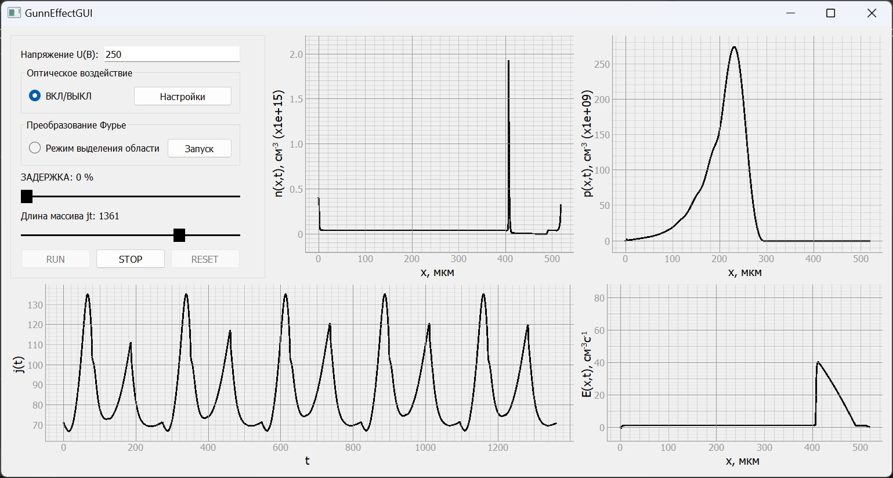

# GunnEffectGUI


Численное моделирование нелинейной динамики пространственного заряда,  электрического поля и тока в структурах GaAs  в условиях локализованного оптического 
воздействия в активной области структуры

## Установка

Программа тестировалась на версиях Python 3.10, 3.12

1. Установите все необходимые зависимости

```
pip install -r requirements.txt
```
2. Запуск

```
python main.py
```

## Описание

Программа для проведения исследований _студентами_ СГУ им. Н.Г. Чернышевского, 
направления Электроника и наноэлектроника.

Программа состоит из главного окна с графиками для исследования электронных процессов в структурах GaAs. 
Инструкция по работе с графиками находится в папке `/doc`



Меню с настройками позволяет изменять параметры, которые
влияют на электронные процессы в структуре.


